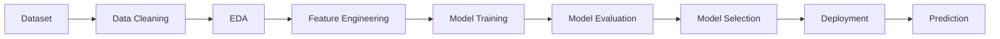
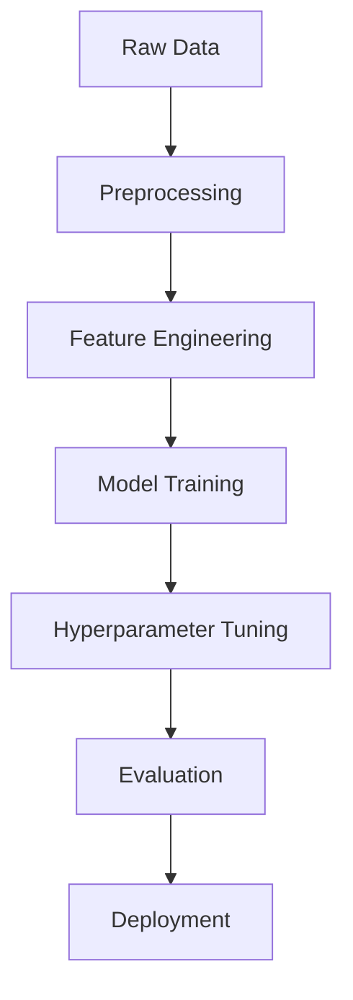

````markdown
<!-- ========================= -->
<!--  Drug Toxicity Predictor  -->
<!-- ========================= -->

<div align="center">

<!-- Logo Placeholder -->


<h1>Drug Toxicity Predictor</h1>

<p>
  <b>Production-ready ML system to predict drug toxicity from molecular descriptors.</b><br/>
  Built for research, rapid prototyping, and deployable inference (API + UI-ready).
</p>

<!-- Badges -->
<p>
  
  
  
</p>

<p>
  
  
  
  
</p>

<p>
  <a href="#project-preview">Preview</a> •
  <a href="#problem-statement">Problem</a> •
  <a href="#key-features">Features</a> •
  <a href="#system-architecture">Architecture</a> •
  <a href="#installation">Install</a> •
  <a href="#usage">Usage</a> •
  <a href="#api-endpoints">API</a> •
  <a href="#deployment">Deploy</a>
</p>

</div>

---

## Project Preview

> Replace these placeholders with real screenshots (recommended: 1200×700 PNG). Keep them dark-theme friendly.

| Dashboard | Prediction | Analytics |
|---|---|---|
|  |  |  |

<details>
<summary><b>Screenshot tips (click)</b></summary>

- Use consistent aspect ratio across screenshots.
- Prefer dark backgrounds and high-contrast charts.
- If using Streamlit, set a dark theme and export images.

</details>

---

## Problem Statement

Drug discovery is expensive and high-risk: many promising compounds fail late in the pipeline due to **toxicity**. Late-stage failures cost significant time, money, and can delay life-saving therapies.

This project addresses the problem by:

- **Predicting toxicity early** from molecular descriptors derived from chemical structures.
- Enabling researchers and engineers to **screen candidates at scale** before costly wet-lab experiments.
- Providing a foundation for **deployable** toxicity inference in modern ML workflows.

**Real-world impact**
- Faster iteration in early discovery stages.
- Reduced attrition in downstream validation.
- Improved safety signals and decision-making.

---

## Key Features

| Feature | Description |
|---|---|
| 🧬 Descriptor-driven modeling | Works with molecular descriptors / fingerprints (e.g., RDKit + Mordred) to turn chemistry into ML-ready features. |
| 🧪 Multi-model benchmarking | Evaluate multiple classical ML models (and optionally DL) with consistent metrics and reproducible splits. |
| 📊 Insightful evaluation | Confusion matrix, ROC/PR curves, feature importance, and experiment tracking-friendly outputs. |
| 🚀 Deployable inference | Designed to support a web UI (e.g., Streamlit) and/or a REST API for production-like usage. |

---

## System Architecture

```mermaid
flowchart TD
  U[User / Researcher] --> UI[Web UI (Streamlit / Frontend)]
  UI --> API[Backend API (Flask / FastAPI)]
  API --> FE[Feature Engineering<br/>(RDKit / Mordred)]
  FE --> M[(Trained Model Artifact)]
  API --> DB[(Optional: Database / Feature Store)]
  API --> R[Prediction Response<br/>(toxicity score / class)]
  R --> UI
```

---

## Complete Workflow



---

## Technology Stack

| Category | Technologies |
|---|---|
| Programming | Python |
| ML | scikit-learn, XGBoost *(optional)* |
| Chemistry / Featurization | RDKit, Mordred *(often local install)* |
| Visualization | Plotly, Matplotlib, Seaborn |
| App / UI | Streamlit |
| API / Deployment | Flask *(or FastAPI)*, Docker *(recommended)* |
| MLOps (optional) | MLflow, DVC |

---

## Folder Structure

> Update this tree to exactly match your repository structure (recommended: add `assets/` for visuals).

```text
project/
│
├── data/
├── notebooks/
├── src/
├── models/
├── static/
├── templates/
├── app.py
├── requirements.txt
└── README.md
```

---

## Dataset Information

> Replace with the real dataset schema used in this project.

| Column | Type | Description |
|---|---|---|
| smiles | Text | SMILES string representing the compound structure. |
| toxicity_label | Categorical | Target label (e.g., toxic / non-toxic). |
| descriptor_* | Numeric | Engineered molecular descriptors used for training. |

<details>
<summary><b>Notes on data and labels (click)</b></summary>

- Ensure labels are defined clearly (binary vs multi-class).
- Track class imbalance and define evaluation strategy accordingly.
- Store a data dictionary in `docs/` for long-term maintainability.

</details>

---

## Exploratory Data Analysis

### Missing Values Analysis
- Identify missing descriptors and decide on imputation or filtering strategy.

### Correlation Analysis
- Detect multicollinearity; consider feature selection or dimensionality reduction.

### Outlier Detection
- Use robust statistics or isolation-based methods to detect anomalous samples.

### Feature Distribution
- Compare distributions across toxicity classes; look for separability.

**Placeholders (replace with real visuals):**

- 
- 
- 
- 

---

## Machine Learning Pipeline



---

## Models Evaluated

> Fill in metrics from your experiments. Highlight the best model based on your primary metric (e.g., ROC-AUC or F1).

| Model | Accuracy | Precision | Recall | F1 Score |
|---|---:|---:|---:|---:|
| Logistic Regression | x | x | x | x |
| Random Forest | x | x | x | x |
| XGBoost | x | x | x | x |

**Best model:** **XGBoost** *(placeholder)*

---

## Performance Dashboard

| Metric | Score |
|---|---:|
| **Accuracy** | x |
| **Precision** | x |
| **Recall** | x |
| **F1 Score** | x |
| **ROC-AUC** | x |

---

## Results Visualization

> Add visuals under `assets/results/` and link them here.

| Visualization | Preview |
|---|---|
| Confusion Matrix |  |
| ROC Curve |  |
| Precision-Recall Curve |  |
| Feature Importance |  |
| Learning Curve |  |
| Residual Plot |  |

---

## API Endpoints

| Method | Endpoint | Description |
|---|---|---|
| POST | `/predict` | Make a toxicity prediction from descriptors/SMILES payload. |
| GET | `/health` | Health check for monitoring and uptime verification. |

---

## Installation

### 1) Clone the repository

```bash
git clone https://github.com/sachinu25/drug-toxicity-predictor.git
cd drug-toxicity-predictor
```

### 2) Create and activate a virtual environment

```bash
python -m venv .venv

# macOS / Linux
source .venv/bin/activate

# Windows (PowerShell)
.venv\Scripts\Activate.ps1
```

### 3) Install dependencies

```bash
pip install -U pip
pip install -r requirements.txt
```

<details>
<summary><b>RDKit / Mordred setup (click)</b></summary>

Chemistry toolchains can be environment-specific.

- **Conda** is commonly used for RDKit:
  ```bash
  conda create -n tox python=3.10 -y
  conda activate tox
  conda install -c conda-forge rdkit -y
  pip install mordred
  ```

</details>

---

## Usage

### Option A — Run the web app (Streamlit)

```bash
streamlit run app.py
```

### Option B — Run an API (Flask example)

```bash
python app.py
```

### Example: prediction request (pseudo)

```python
import requests

payload = {
    "smiles": "CC(=O)OC1=CC=CC=C1C(=O)O",  # aspirin (example)
}

r = requests.post("http://localhost:8000/predict", json=payload, timeout=30)
print(r.json())
```

<details>
<summary><b>Reproducible training (click)</b></summary>

- Fix random seeds.
- Save splits.
- Persist the full preprocessing pipeline.

</details>

---

## Deployment

### Docker (recommended)

```bash
docker build -t drug-toxicity-predictor:latest .
docker run -p 8000:8000 drug-toxicity-predictor:latest
```

### Production checklist

- [ ] Pin dependencies and lock versions.
- [ ] Add input validation (SMILES parsing, schema checks).
- [ ] Add monitoring (latency, error rate, drift signals).
- [ ] Store and version models (e.g., MLflow registry).

---

## Future Improvements

- [ ] Add full training CLI (Typer/Argparse) with config files.
- [ ] Add experiment tracking (MLflow) and dataset versioning (DVC).
- [ ] Add calibrated probabilities and uncertainty estimates.
- [ ] Add explainability (SHAP) and model cards.
- [ ] Add CI (lint + tests) and pre-commit hooks.

---

## Contributors

<p>
  Maintained by <a href="https://github.com/sachinu25">@sachinu25</a>.<br/>
  Contributions are welcome — please open an issue to discuss major changes.
</p>

<details>
<summary><b>How to contribute (click)</b></summary>

1. Fork the repo
2. Create a feature branch: `git checkout -b feature/my-change`
3. Commit: `git commit -m "Add my change"`
4. Push: `git push origin feature/my-change`
5. Open a Pull Request

</details>

---

## License

This project is licensed under the **MIT License**.

---

## Contact

<table>
  <tr>
    <td>
      <b>Maintainer</b><br/>
      Sachin U<br/>
      <a href="https://github.com/sachinu25">GitHub</a>
    </td>
    <td>
      <b>Project</b><br/>
      Drug Toxicity Predictor<br/>
      <a href="https://github.com/sachinu25/drug-toxicity-predictor">Repository</a>
    </td>
  </tr>
</table>

<!-- End of README -->
````
